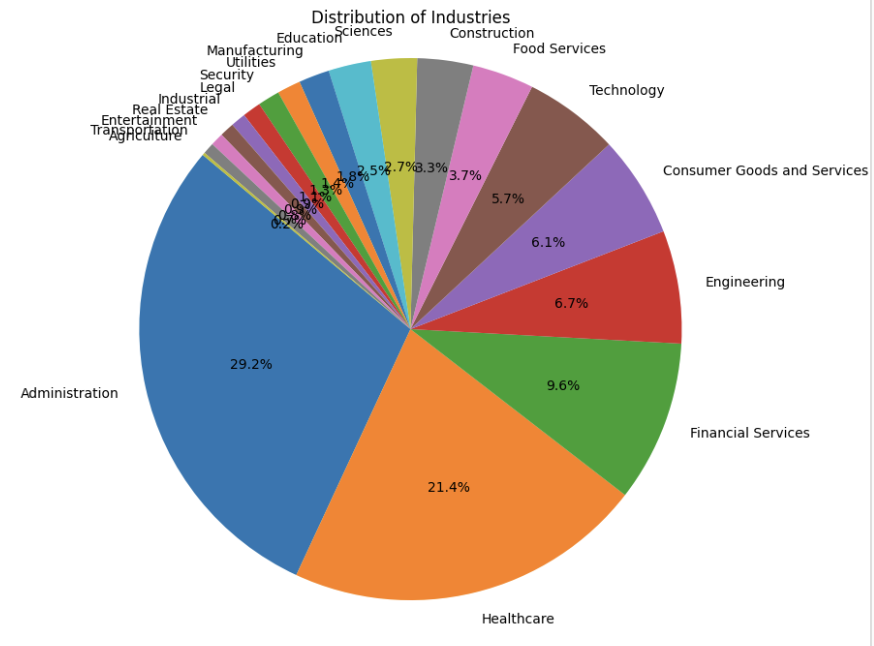
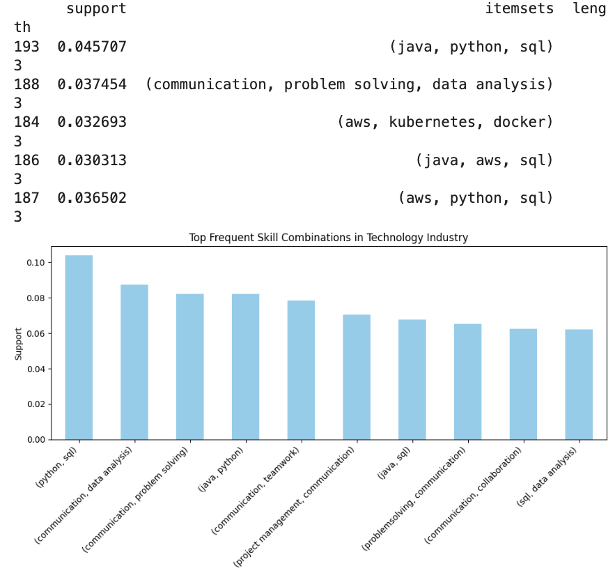
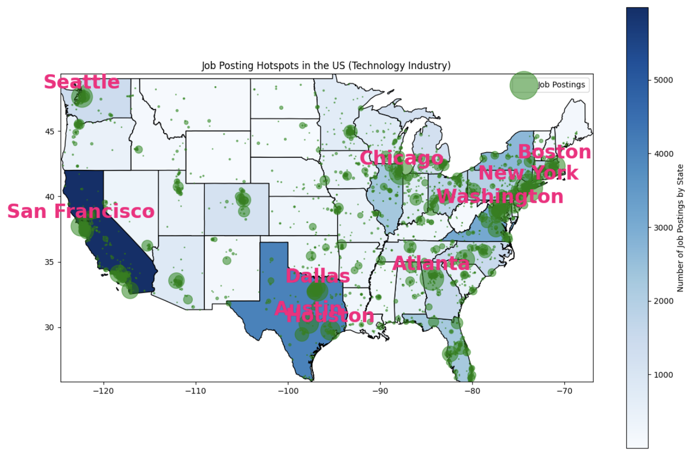
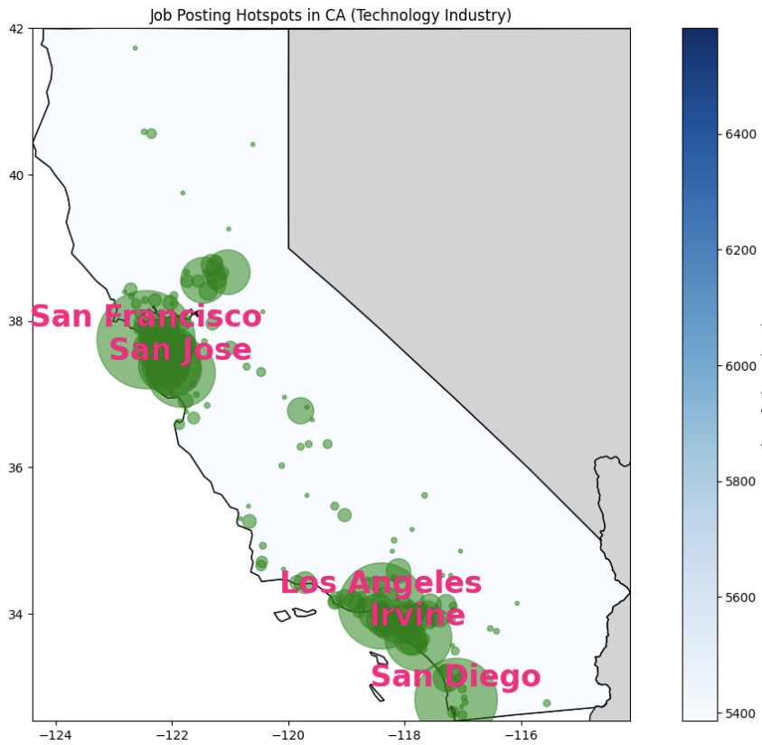

# Part 1: Outline

# Career Navigation with LinkedIn Job Posting Insights
---

- **Team Members:** Alex Archer

## Description:
My project aims to help you navigate your chosen career path by uncovering valuable insights from the LinkedIn job market. By discovering industry hotspots, popular skillsets by industry, and trending skills I intend to help you plan for success.

## Questions to Answer:
**Based On Industry...**
    - In what regions and cities are jobs booming?
    - What are the best skill sets to have?
    - Which skills are in high demand?

## Data Set:
- **Title:** “1.3 M Linkedin Jobs & Skills (2024)”
    - **URL:** https://www.kaggle.com/datasets/asaniczka/1-3m-linkedin-jobs-and-skills-2024?select=linkedin_job_postings.csv
    - **Status:** Downloaded locally on my machine

## Results in the Context of the `Technology` Industry
### Top Skills in Tech

---
### Industry Proportions of Job Market

---
### Apriori Determined Popular Skillsets

---
### National Tech Hotspots

---
### California Tech Hotspots

---

## Applications of Knowledge
The Insights Discovered above has numerous real-world applications for job-seekers and educational institutions alike. As a Software Engineer, I now have a candid insight into some of the most important determining factors for career success such as the most in-demand skills(`SQL`, `Python`, `Java`, etc.), in addition to the most in-demand skill sets (`(SQL, Python)`, `(AWS, Kubernetes, Docker)`, etc.). As a result of these insights I Also have a nuanced understanding of where I can expect to find work. Examining the aational scale industry boom map, it's clear that tech jobs are concentrated in the east and west. California appears to be the darkest, so it is chosen as the subject for the state-level analysis, Where I can clearly see that the most opportunities are in `SanFrancisco`, `San Diego`, `San Jose`, `Los Angeles`, and `Irvine`. 

## Link to Video:
https://www.youtube.com/watch?v=SaSj2wXWLgM
